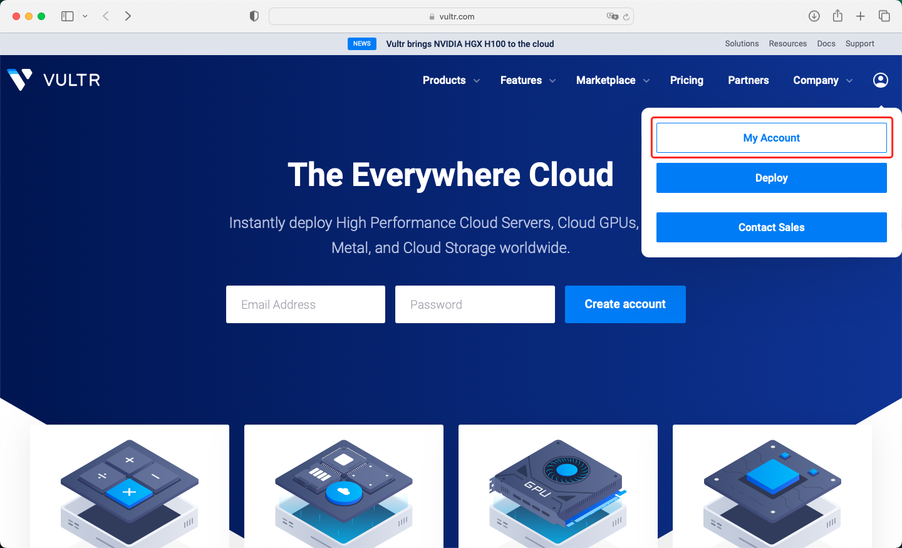
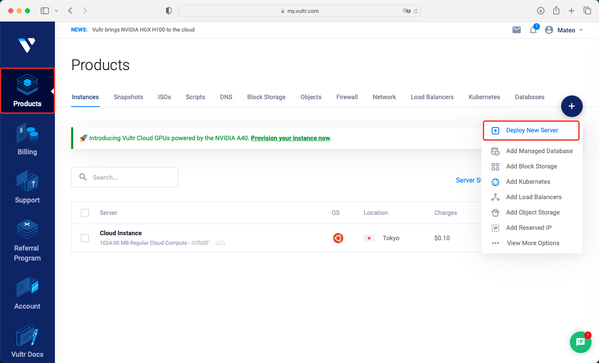
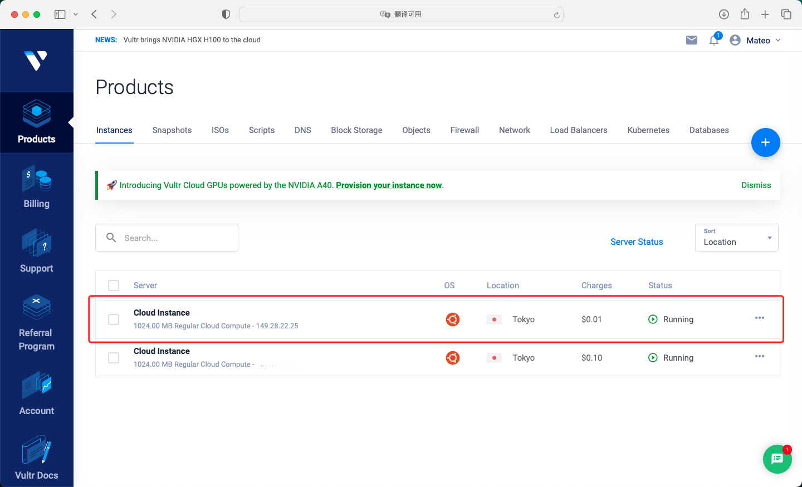
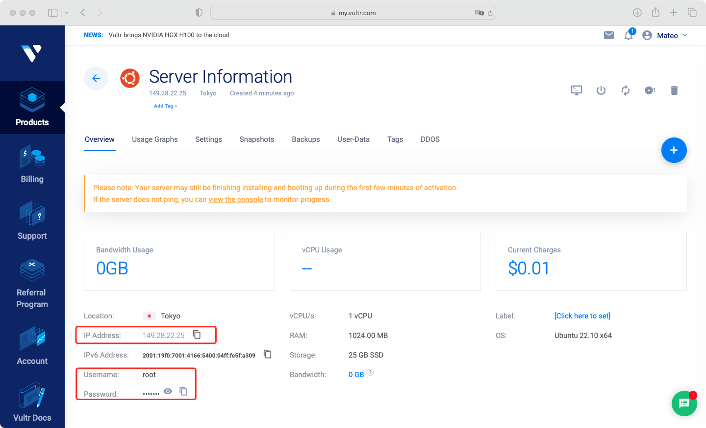
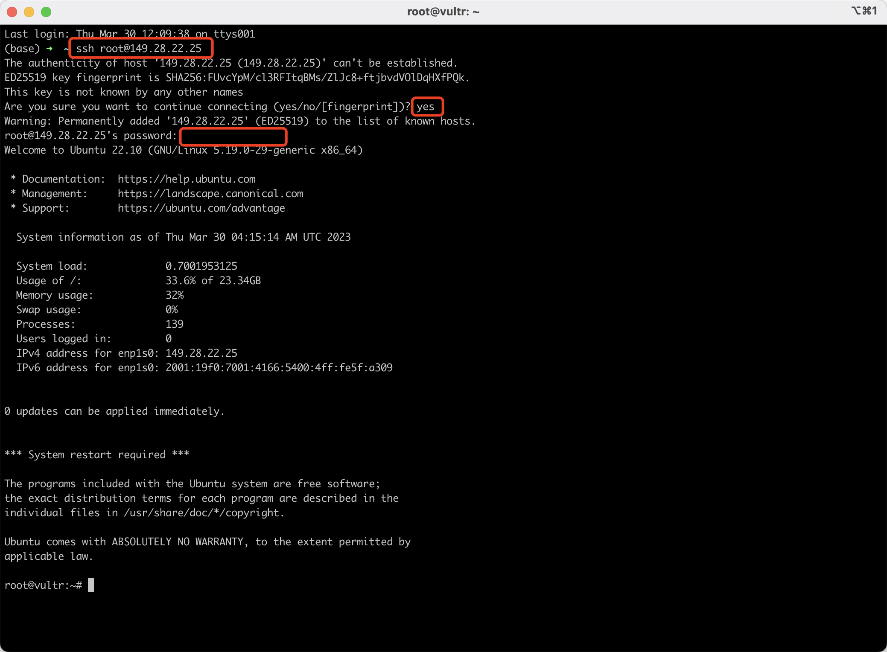
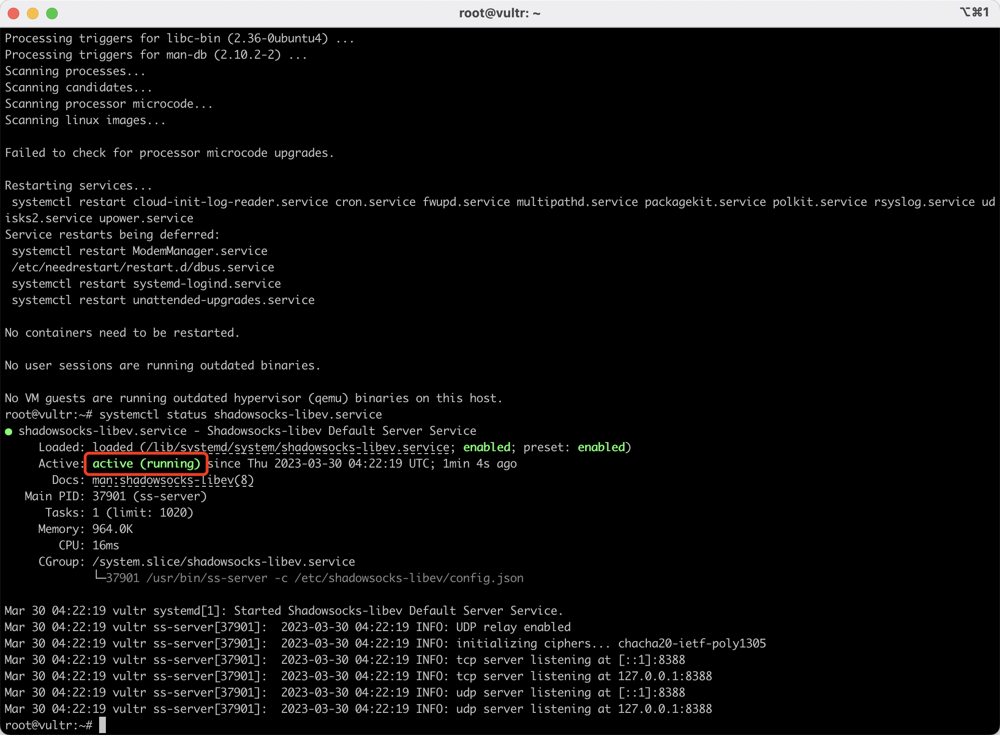
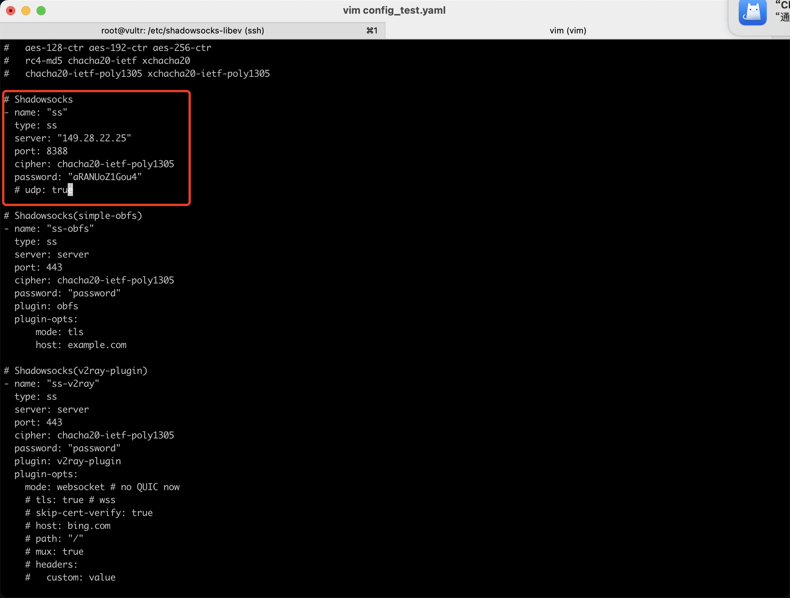
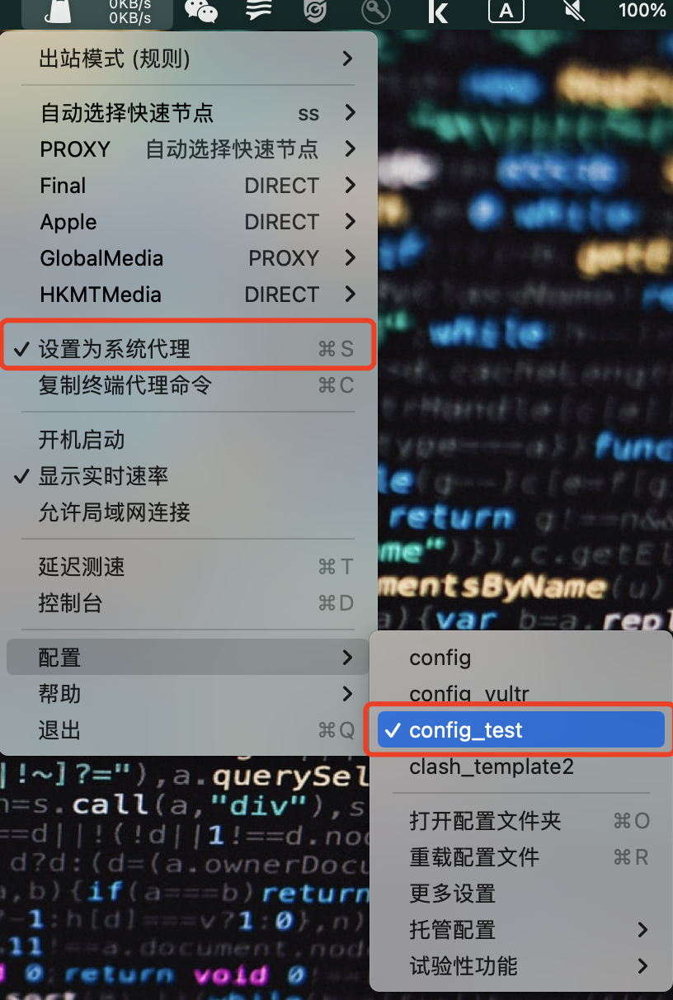
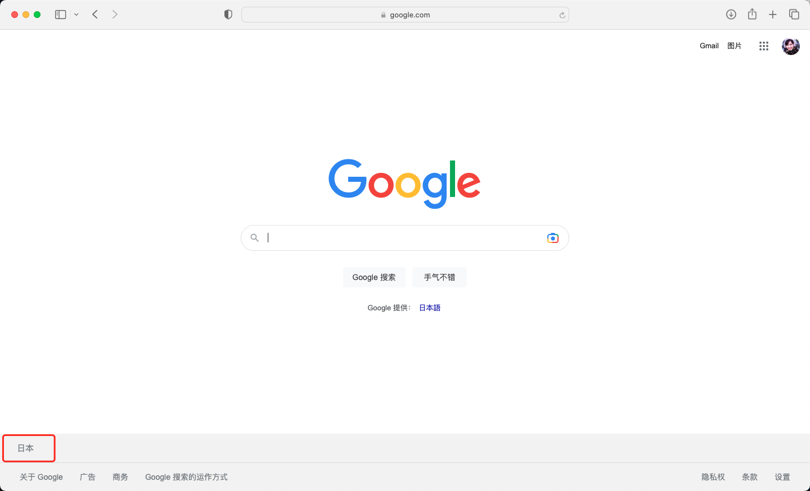

### 服务器购买与配置

---

*看了好几个教程，总感觉讲得不够清楚，一头雾水。虽然本科上过计网但啥都没学到，这样的教程可能不适合我等非科班选手。所以，打算自己记录和分享一下自己的历程。仅供参考～*

#### 引言

---

- **适用对象（参考作者背景）**
  - 纯新手 / 搞不懂各种网络协议
- **个人需求和目的**
  - 科学上网 / 搭梯子 / 建个人网站 / 随便玩玩 / 一直用现成VPN，想有自己的服务器有更多玩法 etc.

#### 服务器购买

---

0. **明确一点**：别老想着找免费服务器白嫖了，花点钱收获方便、稳定、安全
1. **服务器供应商选择**：需要海外服务器，使用Vultr，打开官网https://www.vultr.com
2. **注册账号**：用邮箱注册一个账号，然后登陆后点击右上角个人头像的***<u>My Account</u>***

3. **充值**：点击左边的Billing，然后用Alipay支付宝充值就行（刚开始充10美元即可）

4. **部署**：充值完后就可以开始定制自己的服务器了

   - 点击左边**<u>*Products*</u>**，然后右边*➕*号，点击**<u>*Deploy New Server*</u>**

   

   - 配置自己选择即可（怎么便宜怎么来），注意系统选择**<u>*Ubuntu 22.10 x64*</u>**，节点选离自己近的
   - 然后点击右下角**<u>*Deploy Now*</u>**
   - **<u>*Status*</u>**由**<u>*Installing*</u>**变为**<u>*Running*</u>**后，就可以`ping`通，再等待几分钟系统初始化后即可`ssh`连接（以下面这个为具体例子）

   

   

   - 终端`ssh`连接（作者本地电脑为Mac）

   

#### 服务器与本地电脑配置

---

1. **服务器端配置**

   - 安装shadowsocks：`apt install shadowsocks-libev`，输入`y`后一路回车，完成后查看运行状态，显示running即可

   

   - 到目录`cd /etc/shadowsocks-libev`，编辑配置文件`vim config.json`
   - 更改server为["0.0.0.0"]
   - 其他不用变（server_port和local_port随意，按默认设置也可以）
   - 打开对应端口`ufw allow 8388`，再查看端口是否打开`ufw status`
   - 重启shadowsocks：`systemctl restart shadowsocks-libev.service`
   - 并确认其状态显示为running，且端口正确：`systemctl status shadowsocks-libev.service`

2. **本地电脑配置**

   - 下载并安装ClashX：https://github.com/yichengchen/clashX（windows等下载类似的客户端）

   - 本地电脑ClashX配置文件，新建终端

     - 进入配置文件夹`cd /Users/YOUR-NAME/.config/clash`
     - 下载模板文件`wget https://www.bwgss.org/wp-content/uploads/2020/11/clash_template2.yaml -O clash_template2.yaml`
     - 复制一份新的配置文件`cp clash_template2.yaml config_test.yaml`，修改如图所示内容（需要与服务器端的一致）

     

3. 选择刚才的配置文件，然后设置为系统代理，开始科学上网（IP也变为服务器所在地）

